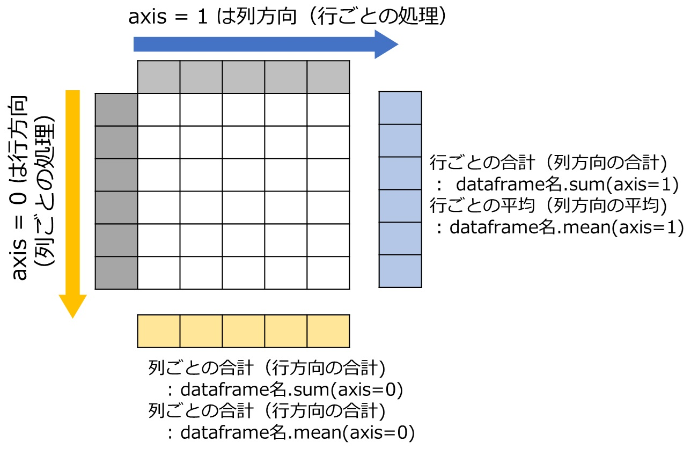

# DataFrameからの条件抽出


```python
import pandas as pd
profiles =[['Lucy',160,52,'A','USA','20','student','female','tennis','married'],
 ['Bob',180,52,'O','England','30','dentist', 'male','game','single'],
 ['Shohei',193,80,'AB','Japan','30','MLB', 'male','baseball','married'],
 ['Mami',180,62,'B','Japan','28','wife', 'female','baseball','married'],
 ['Frank',190,80,'O','Germany','15','student','male','ski','single'],
 ['Naomi',185,70,'A','Japan','30','tennis player','fimale','game','marreid']]
profile_df = pd.DataFrame(profiles, index=['U1','E1','J1','J2','FR','NA'],
                          columns = ['name','height','weight','blood type','nation','age','occupation','male/female','hobby','married'])

profile_df

```


<div>
<style scoped>
    .dataframe tbody tr th:only-of-type {
        vertical-align: middle;
    }

    .dataframe tbody tr th {
        vertical-align: top;
    }

    .dataframe thead th {
        text-align: right;
    }
</style>
<table border="1" class="dataframe">
  <thead>
    <tr style="text-align: right;">
      <th></th>
      <th>name</th>
      <th>height</th>
      <th>weight</th>
      <th>blood type</th>
      <th>nation</th>
      <th>age</th>
      <th>occupation</th>
      <th>male/female</th>
      <th>hobby</th>
      <th>married</th>
    </tr>
  </thead>
  <tbody>
    <tr>
      <th>U1</th>
      <td>Lucy</td>
      <td>160</td>
      <td>52</td>
      <td>A</td>
      <td>USA</td>
      <td>20</td>
      <td>student</td>
      <td>female</td>
      <td>tennis</td>
      <td>married</td>
    </tr>
    <tr>
      <th>E1</th>
      <td>Bob</td>
      <td>180</td>
      <td>52</td>
      <td>O</td>
      <td>England</td>
      <td>30</td>
      <td>dentist</td>
      <td>male</td>
      <td>game</td>
      <td>single</td>
    </tr>
    <tr>
      <th>J1</th>
      <td>Shohei</td>
      <td>193</td>
      <td>80</td>
      <td>AB</td>
      <td>Japan</td>
      <td>30</td>
      <td>MLB</td>
      <td>male</td>
      <td>baseball</td>
      <td>married</td>
    </tr>
    <tr>
      <th>J2</th>
      <td>Mami</td>
      <td>180</td>
      <td>62</td>
      <td>B</td>
      <td>Japan</td>
      <td>28</td>
      <td>wife</td>
      <td>female</td>
      <td>baseball</td>
      <td>married</td>
    </tr>
    <tr>
      <th>FR</th>
      <td>Frank</td>
      <td>190</td>
      <td>80</td>
      <td>O</td>
      <td>Germany</td>
      <td>15</td>
      <td>student</td>
      <td>male</td>
      <td>ski</td>
      <td>single</td>
    </tr>
    <tr>
      <th>NA</th>
      <td>Naomi</td>
      <td>185</td>
      <td>70</td>
      <td>A</td>
      <td>Japan</td>
      <td>30</td>
      <td>tennis player</td>
      <td>fimale</td>
      <td>game</td>
      <td>marreid</td>
    </tr>
  </tbody>
</table>
</div>


### 構文：dataframe名[  dataframe名['columns名'] 抽出条件 ]  
**例1. weight > 60 のデータを抽出**   


```python
profile_df[profile_df['weight']>60]
```


<div>
<style scoped>
    .dataframe tbody tr th:only-of-type {
        vertical-align: middle;
    }

    .dataframe tbody tr th {
        vertical-align: top;
    }

    .dataframe thead th {
        text-align: right;
    }
</style>
<table border="1" class="dataframe">
  <thead>
    <tr style="text-align: right;">
      <th></th>
      <th>name</th>
      <th>height</th>
      <th>weight</th>
      <th>blood type</th>
      <th>nation</th>
      <th>age</th>
      <th>occupation</th>
      <th>male/female</th>
      <th>hobby</th>
      <th>married</th>
    </tr>
  </thead>
  <tbody>
    <tr>
      <th>J1</th>
      <td>Shohei</td>
      <td>193</td>
      <td>80</td>
      <td>AB</td>
      <td>Japan</td>
      <td>30</td>
      <td>MLB</td>
      <td>male</td>
      <td>baseball</td>
      <td>married</td>
    </tr>
    <tr>
      <th>J2</th>
      <td>Mami</td>
      <td>180</td>
      <td>62</td>
      <td>B</td>
      <td>Japan</td>
      <td>28</td>
      <td>wife</td>
      <td>female</td>
      <td>baseball</td>
      <td>married</td>
    </tr>
    <tr>
      <th>FR</th>
      <td>Frank</td>
      <td>190</td>
      <td>80</td>
      <td>O</td>
      <td>Germany</td>
      <td>15</td>
      <td>student</td>
      <td>male</td>
      <td>ski</td>
      <td>single</td>
    </tr>
    <tr>
      <th>NA</th>
      <td>Naomi</td>
      <td>185</td>
      <td>70</td>
      <td>A</td>
      <td>Japan</td>
      <td>30</td>
      <td>tennis player</td>
      <td>fimale</td>
      <td>game</td>
      <td>marreid</td>
    </tr>
  </tbody>
</table>
</div>


**例2. male のデータを抽出**


```python
profile_df[profile_df['male/female']=='male']
```


<div>
<style scoped>
    .dataframe tbody tr th:only-of-type {
        vertical-align: middle;
    }

    .dataframe tbody tr th {
        vertical-align: top;
    }

    .dataframe thead th {
        text-align: right;
    }
</style>
<table border="1" class="dataframe">
  <thead>
    <tr style="text-align: right;">
      <th></th>
      <th>name</th>
      <th>height</th>
      <th>weight</th>
      <th>blood type</th>
      <th>nation</th>
      <th>age</th>
      <th>occupation</th>
      <th>male/female</th>
      <th>hobby</th>
      <th>married</th>
    </tr>
  </thead>
  <tbody>
    <tr>
      <th>E1</th>
      <td>Bob</td>
      <td>180</td>
      <td>52</td>
      <td>O</td>
      <td>England</td>
      <td>30</td>
      <td>dentist</td>
      <td>male</td>
      <td>game</td>
      <td>single</td>
    </tr>
    <tr>
      <th>J1</th>
      <td>Shohei</td>
      <td>193</td>
      <td>80</td>
      <td>AB</td>
      <td>Japan</td>
      <td>30</td>
      <td>MLB</td>
      <td>male</td>
      <td>baseball</td>
      <td>married</td>
    </tr>
    <tr>
      <th>FR</th>
      <td>Frank</td>
      <td>190</td>
      <td>80</td>
      <td>O</td>
      <td>Germany</td>
      <td>15</td>
      <td>student</td>
      <td>male</td>
      <td>ski</td>
      <td>single</td>
    </tr>
  </tbody>
</table>
</div>


### 複合条件抽出  
### 構文
---  
  ### 1) and： dataframe名[ (dataframe名['columns名'] 抽出条件) & (dataframe名['columns名'] 抽出条件) ]  )  
  ### 2) or :  dataframe名[ (dataframe名['columns名'] 抽出条件) | (dataframe名['columns名'] 抽出条件) ]  ) 
---

**例4. height > 180 and weight > 60 のデータを抽出**   


```python
profile_df[(profile_df['height']>180) & (profile_df['weight']>60)]
```


<div>
<style scoped>
    .dataframe tbody tr th:only-of-type {
        vertical-align: middle;
    }

    .dataframe tbody tr th {
        vertical-align: top;
    }

    .dataframe thead th {
        text-align: right;
    }
</style>
<table border="1" class="dataframe">
  <thead>
    <tr style="text-align: right;">
      <th></th>
      <th>name</th>
      <th>height</th>
      <th>weight</th>
      <th>blood type</th>
      <th>nation</th>
      <th>age</th>
      <th>occupation</th>
      <th>male/female</th>
      <th>hobby</th>
      <th>married</th>
    </tr>
  </thead>
  <tbody>
    <tr>
      <th>J1</th>
      <td>Shohei</td>
      <td>193</td>
      <td>80</td>
      <td>AB</td>
      <td>Japan</td>
      <td>30</td>
      <td>MLB</td>
      <td>male</td>
      <td>baseball</td>
      <td>married</td>
    </tr>
    <tr>
      <th>FR</th>
      <td>Frank</td>
      <td>190</td>
      <td>80</td>
      <td>O</td>
      <td>Germany</td>
      <td>15</td>
      <td>student</td>
      <td>male</td>
      <td>ski</td>
      <td>single</td>
    </tr>
    <tr>
      <th>NA</th>
      <td>Naomi</td>
      <td>185</td>
      <td>70</td>
      <td>A</td>
      <td>Japan</td>
      <td>30</td>
      <td>tennis player</td>
      <td>fimale</td>
      <td>game</td>
      <td>marreid</td>
    </tr>
  </tbody>
</table>
</div>


例5. male または height > 180


```python
profile_df[(profile_df['male/female']=='male') | (profile_df['height']>180)]
```


<div>
<style scoped>
    .dataframe tbody tr th:only-of-type {
        vertical-align: middle;
    }

    .dataframe tbody tr th {
        vertical-align: top;
    }

    .dataframe thead th {
        text-align: right;
    }
</style>
<table border="1" class="dataframe">
  <thead>
    <tr style="text-align: right;">
      <th></th>
      <th>name</th>
      <th>height</th>
      <th>weight</th>
      <th>blood type</th>
      <th>nation</th>
      <th>age</th>
      <th>occupation</th>
      <th>male/female</th>
      <th>hobby</th>
      <th>married</th>
    </tr>
  </thead>
  <tbody>
    <tr>
      <th>E1</th>
      <td>Bob</td>
      <td>180</td>
      <td>52</td>
      <td>O</td>
      <td>England</td>
      <td>30</td>
      <td>dentist</td>
      <td>male</td>
      <td>game</td>
      <td>single</td>
    </tr>
    <tr>
      <th>J1</th>
      <td>Shohei</td>
      <td>193</td>
      <td>80</td>
      <td>AB</td>
      <td>Japan</td>
      <td>30</td>
      <td>MLB</td>
      <td>male</td>
      <td>baseball</td>
      <td>married</td>
    </tr>
    <tr>
      <th>FR</th>
      <td>Frank</td>
      <td>190</td>
      <td>80</td>
      <td>O</td>
      <td>Germany</td>
      <td>15</td>
      <td>student</td>
      <td>male</td>
      <td>ski</td>
      <td>single</td>
    </tr>
    <tr>
      <th>NA</th>
      <td>Naomi</td>
      <td>185</td>
      <td>70</td>
      <td>A</td>
      <td>Japan</td>
      <td>30</td>
      <td>tennis player</td>
      <td>fimale</td>
      <td>game</td>
      <td>marreid</td>
    </tr>
  </tbody>
</table>
</div>


# 演算処理
## 1. 合計と平均の計算
### 構文    

```python
1) 行ごとの合計（列方向の合計) 
    :  dataframe名.sum(axis=1)    
2)列ごとの合計（行方向の合計)
    : dataframe名.sum(axis=0)
3)行ごとの平均（列方向の平均)
    : dataframe名.mean(axis=1)
4)列ごとの合計（行方向の合計)
    : dataframe名.mean(axis=0)
```



例：profile_df について1)~5)を計算する


```python
profile_df.sum(axis=1,numeric_only=True)
```


    U1    212
    E1    232
    J1    273
    J2    242
    FR    270
    NA    255
    dtype: int64


```python
profile_df.sum(axis=0,numeric_only=True)
# ageは文字型なので、対象外
```


    height    1088
    weight     396
    dtype: int64


```python
profile_df.mean(axis=1,numeric_only=True)
```


    U1    106.0
    E1    116.0
    J1    136.5
    J2    121.0
    FR    135.0
    NA    127.5
    dtype: float64


```python
profile_df.mean(axis=0,numeric_only=True)
```


    height    181.333333
    weight     66.000000
    dtype: float64


## 2. 条件抽出と演算の複合
例1. heightの平均


```python
profile_df['height'].mean(axis=0)
```


    181.33333333333334


例2. hobby = baseball のheight平均


```python
profile_df[profile_df['hobby']=='baseball']['height'].mean(axis=0)
```


    186.5


#### 最後の例で、もしhobby毎にすべて平均を計算する場合、hobby毎に１つ１つプログラムを書く必要がある。hobbyについて、取りうる値毎にすべての平均を一度に計算する方法はないだろうか

# グルーピング
指定したcolumnの取りうる値毎にグループ化して、小計、平均などを計算する  
### 構文  

---    
```python
    dataframe名.groupby('column名').sum() 
```
--- 
例1. profile_dfをhobby毎に合計をとる


```python
profile_df.groupby('hobby').sum(numeric_only=True)
# groupbyで指定したcolumnが行ラベルになっていることに注意
```


<div>
<style scoped>
    .dataframe tbody tr th:only-of-type {
        vertical-align: middle;
    }

    .dataframe tbody tr th {
        vertical-align: top;
    }

    .dataframe thead th {
        text-align: right;
    }
</style>
<table border="1" class="dataframe">
  <thead>
    <tr style="text-align: right;">
      <th></th>
      <th>height</th>
      <th>weight</th>
    </tr>
    <tr>
      <th>hobby</th>
      <th></th>
      <th></th>
    </tr>
  </thead>
  <tbody>
    <tr>
      <th>baseball</th>
      <td>373</td>
      <td>142</td>
    </tr>
    <tr>
      <th>game</th>
      <td>365</td>
      <td>122</td>
    </tr>
    <tr>
      <th>ski</th>
      <td>190</td>
      <td>80</td>
    </tr>
    <tr>
      <th>tennis</th>
      <td>160</td>
      <td>52</td>
    </tr>
  </tbody>
</table>
</div>


**例2. profile_dfをhobby毎に平均をとる**


```python
profile_df.groupby('hobby').mean(numeric_only=True)
```


<div>
<style scoped>
    .dataframe tbody tr th:only-of-type {
        vertical-align: middle;
    }

    .dataframe tbody tr th {
        vertical-align: top;
    }

    .dataframe thead th {
        text-align: right;
    }
</style>
<table border="1" class="dataframe">
  <thead>
    <tr style="text-align: right;">
      <th></th>
      <th>height</th>
      <th>weight</th>
    </tr>
    <tr>
      <th>hobby</th>
      <th></th>
      <th></th>
    </tr>
  </thead>
  <tbody>
    <tr>
      <th>baseball</th>
      <td>186.5</td>
      <td>71.0</td>
    </tr>
    <tr>
      <th>game</th>
      <td>182.5</td>
      <td>61.0</td>
    </tr>
    <tr>
      <th>ski</th>
      <td>190.0</td>
      <td>80.0</td>
    </tr>
    <tr>
      <th>tennis</th>
      <td>160.0</td>
      <td>52.0</td>
    </tr>
  </tbody>
</table>
</div>


# データの更新

### 構文： 

--- 
```python
    dataframe名.loc[行ラベル,列ラベル]=更新する値  
    dataframe名.iloc[行index,列index]=更新する値  
```
--- 


**例1. shohei, height を193->192に更新  次に192 -> 190 に更新**


```python
profile_df.loc['J1','height']=192
print(profile_df)
profile_df.iloc[2,1]=190
print(profile_df)
```

          name  height  weight blood type   nation age     occupation male/female  \
    U1    Lucy     160      52          A      USA  20        student      female   
    E1     Bob     180      52          O  England  30        dentist        male   
    J1  Shohei     192      80         AB    Japan  30            MLB        male   
    J2    Mami     180      62          B    Japan  28           wife      female   
    FR   Frank     190      80          O  Germany  15        student        male   
    NA   Naomi     185      70          A    Japan  30  tennis player      fimale   
    
           hobby  married  
    U1    tennis  married  
    E1      game   single  
    J1  baseball  married  
    J2  baseball  married  
    FR       ski   single  
    NA      game  marreid  
          name  height  weight blood type   nation age     occupation male/female  \
    U1    Lucy     160      52          A      USA  20        student      female   
    E1     Bob     180      52          O  England  30        dentist        male   
    J1  Shohei     190      80         AB    Japan  30            MLB        male   
    J2    Mami     180      62          B    Japan  28           wife      female   
    FR   Frank     190      80          O  Germany  15        student        male   
    NA   Naomi     185      70          A    Japan  30  tennis player      fimale   
    
           hobby  married  
    U1    tennis  married  
    E1      game   single  
    J1  baseball  married  
    J2  baseball  married  
    FR       ski   single  
    NA      game  marreid  
    


# 行毎繰り返し処理
### 構文

--- 
``` python
    for k, row in dataframe名.iterrows():
        print(k) # 行ラベルが表示される
        print(row) # 行データが表示される
```
--- 

**例1. profile_dfを行毎に逐次読む**


```python
for k, row in profile_df.iterrows():
    print(k)
    print(row) # 行毎に列ラベルがついた状態で表示される


```

    U1
    name              Lucy
    height             160
    weight              52
    blood type           A
    nation             USA
    age                 20
    occupation     student
    male/female     female
    hobby           tennis
    married        married
    Name: U1, dtype: object
    E1
    name               Bob
    height             180
    weight              52
    blood type           O
    nation         England
    age                 30
    occupation     dentist
    male/female       male
    hobby             game
    married         single
    Name: E1, dtype: object
    J1
    name             Shohei
    height              190
    weight               80
    blood type           AB
    nation            Japan
    age                  30
    occupation          MLB
    male/female        male
    hobby          baseball
    married         married
    Name: J1, dtype: object
    J2
    name               Mami
    height              180
    weight               62
    blood type            B
    nation            Japan
    age                  28
    occupation         wife
    male/female      female
    hobby          baseball
    married         married
    Name: J2, dtype: object
    FR
    name             Frank
    height             190
    weight              80
    blood type           O
    nation         Germany
    age                 15
    occupation     student
    male/female       male
    hobby              ski
    married         single
    Name: FR, dtype: object
    NA
    name                   Naomi
    height                   185
    weight                    70
    blood type                 A
    nation                 Japan
    age                       30
    occupation     tennis player
    male/female           fimale
    hobby                   game
    married              marreid
    Name: NA, dtype: object
    

**例2.行毎にname, height, weightの値を表示する**


```python

for k, row in profile_df.iterrows():
    print(row['name'],row['height'],row['weight'])
```

    Lucy 160 52
    Bob 180 52
    Shohei 190 80
    Mami 180 62
    Frank 190 80
    Naomi 185 70
    

**例3.行毎に逐次読み、各列の値をリスト型で表示する**


```python
for k, row in profile_df.iterrows():
    print([i for c,i in row.items()])
```

    ['Lucy', 160, 52, 'A', 'USA', '20', 'student', 'female', 'tennis', 'married']
    ['Bob', 180, 52, 'O', 'England', '30', 'dentist', 'male', 'game', 'single']
    ['Shohei', 190, 80, 'AB', 'Japan', '30', 'MLB', 'male', 'baseball', 'married']
    ['Mami', 180, 62, 'B', 'Japan', '28', 'wife', 'female', 'baseball', 'married']
    ['Frank', 190, 80, 'O', 'Germany', '15', 'student', 'male', 'ski', 'single']
    ['Naomi', 185, 70, 'A', 'Japan', '30', 'tennis player', 'fimale', 'game', 'marreid']
    


```python

```
